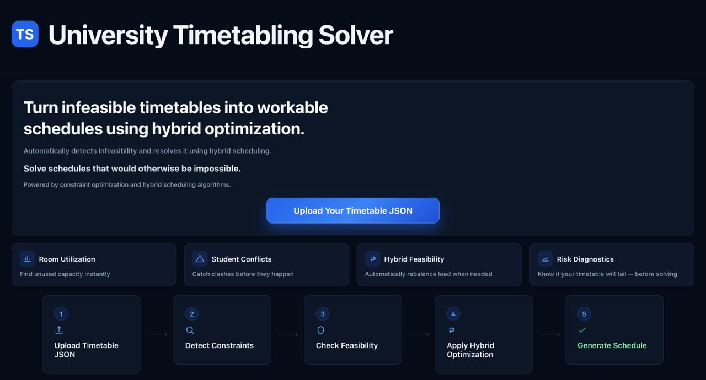
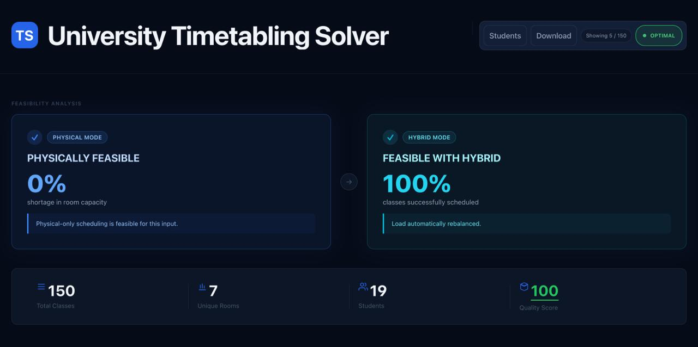
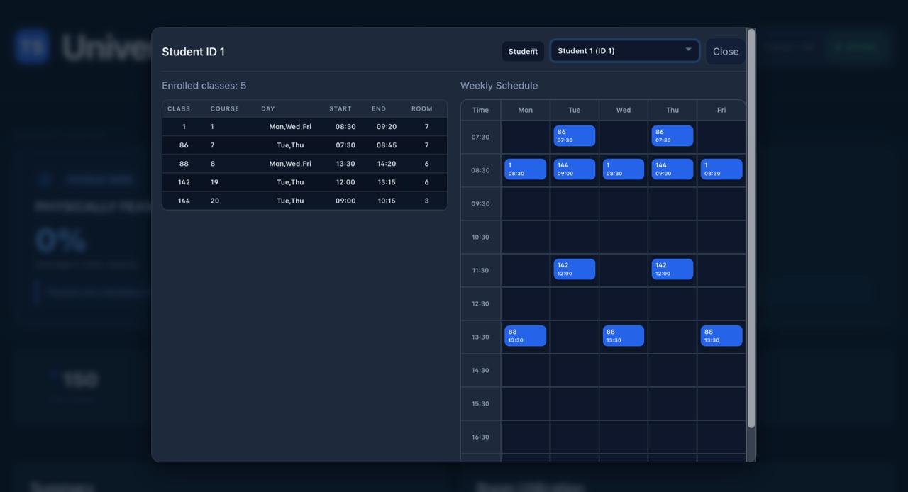
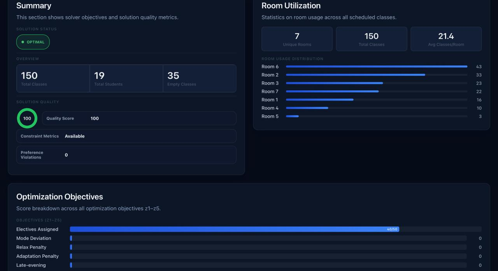
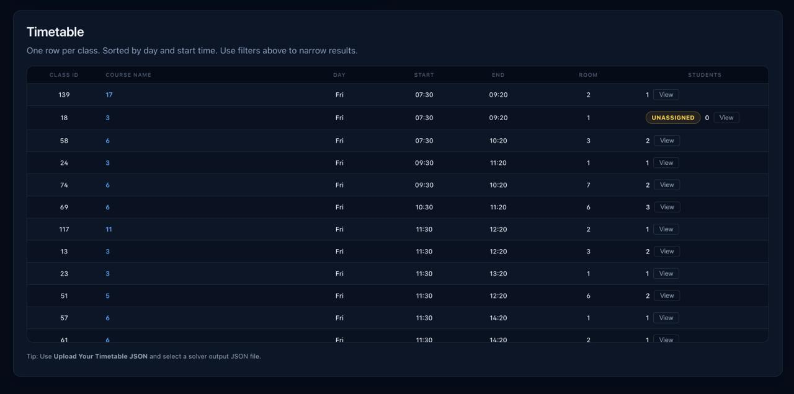
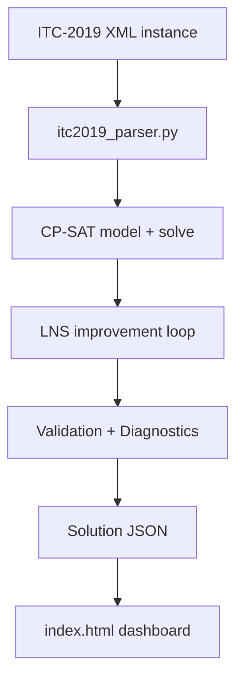

# University Timetabling Optimization System
[](https://girishk03.github.io/University-Timetabling-Solver/)
[](https://python.org)
[](https://developers.google.com/optimization)


[**🚀 Live Demo**](https://girishk03.github.io/University-Timetabling-Solver/)

A hybrid scheduling + optimization system that detects infeasible university timetables and automatically generates feasible schedules using Google OR-Tools CP-SAT and Large Neighborhood Search (LNS).

This targets real operational constraints (room capacity, student clashes, hybrid delivery) and produces a decision-support JSON output with diagnostics + recommendations.

## Key Highlights

- **Infeasibility Detection**: Identifies room-capacity bottlenecks in physical-only schedules.
- **Hybrid Optimization**: Automatically generates feasible schedules by balancing in-person, online, and hybrid delivery.
- **Stability-Aware Repair**: Minimizes timetable "churn" and disruption during re-optimization.
- **Lexicographic Solver**: Multi-objective CP-SAT formulation (Electives > Mode > Clashes > Evening).
- **Interactive Analytics**: Full diagnostic dashboard for room utilization and student conflict analysis.

## Visuals

### Dashboard Landing


*Modern entry point for uploading ITC-2019 instances and initiating the optimization pipeline.*

### Feasibility Analysis (Physical vs. Hybrid)


*The core engine: detecting 0% physical feasibility and automatically repairing it to 100% hybrid feasibility.*

### Student Schedule View


*Granular student-level validation ensuring zero clashes and respecting individual delivery preferences.*

## Additional Dashboard Features

### Optimization Objectives & Room Utilization


*Real-time tracking of the 5-tier objective stack and precise room occupancy heatmaps.*

### Diagnostics & Occupancy


*Automated risk assessment and ranked recommendations for infrastructure planning.*

### Interactive Timetable


*Searchable, filtered view of the final optimized schedule with direct links to student diagnostics.*

## System Workflow

```text
ITC-2019 XML Input
        ↓
Parser & Normalization
        ↓
CP-SAT Optimization Model
        ↓
Large Neighborhood Search (LNS)
        ↓
Validation & Diagnostics
        ↓
Interactive Dashboard + JSON Output
```

## Architecture (high-level)




## Quick Start

### 1. Install Dependencies

```bash
pip install -r requirements.txt
```

Requires: `ortools`, `numpy` (optional for visualization)

### 2. Run Solver

```bash
# Solve ITC-2019 XML instance
python -m src.run_solver instances/itc2019/wbg-fal10.xml

# With custom output path
python -m src.run_solver instances/itc2019/wbg-fal10.xml my_solution.json
```

### 3. Configure Solver (Environment Variables)

```bash
export BASE_TIME=10.0        # Max solve time (seconds)
export LNS_ITERS=5           # LNS iterations
export LNS_TIME=1.0          # Time per LNS iteration
export LNS_DESTROY=0.2       # Destroy fraction (20%)
export LNS_SEED=0            # Random seed
export NUM_WORKERS=8         # CP-SAT parallel workers
export ENABLE_ONLINE=1       # 1 = hybrid/online enabled, 0 = strict physical-only (pure ITC)
export RELAX_ON_INFEASIBLE=1 # Retry with relaxation if strict model is infeasible
export RELAX_MAX_OVERLAP=5   # Relaxed max classes per student at same time
export RELAX_ROOM_OVERCAP=200 # Relaxed extra in-person seats allowed per class

python -m src.run_solver instances/itc2019/wbg-fal10.xml
```

### 4. View Results

```bash
# Start local server
python -m http.server 8000

# Open http://localhost:8000/index.html
```

The dashboard auto-loads `full_solution.json` and displays:
- Solution status and objective values (z1-z5)
- Room utilization statistics
- Class occupancy charts
- Interactive timetable table (main class-wise schedule)
- Student detail modal (class list and weekly schedule grid inside modal)
- Student-focused controls (`Select Student`, `Students`, `Download`)
- Diagnostics panel (input risk, violations, recommendations)

Solver status contract from `run_solver.py`:
- `OPTIMAL`
- `FEASIBLE`
- `INFEASIBLE` (with explanatory message)
- `UNKNOWN` (timeout/partial warning)

## Project Structure

```
windsurf-project-2/
├── src/
│   ├── run_solver.py              # Entry point
│   └── timetabling/
│       ├── solver_cp_sat.py       # CP-SAT solver + LNS (~800 lines)
│       └── itc2019_parser.py      # XML parser (~280 lines)
├── instances/
│   └── itc2019/
│       └── wbg-fal10.xml          # Sample dataset
├── docs/uml/
│   ├── class_diagram_v2.puml      # UML diagrams (8 total)
│   ├── sequence_diagram_v2.puml
│   └── ...
├── index.html                     # Web dashboard
├── requirements.txt               # Python dependencies
└── full_solution.json             # Sample output
```

## What Makes This Engineering-Relevant

- **Feasibility repair**: Detects infeasibility drivers (e.g., demand > room capacity) and generates a workable hybrid schedule.
- **Optimization under constraints**: Multi-objective CP-SAT formulation plus an LNS improvement loop.
- **Decision support output**: Diagnostics + ranked recommendations designed to be acted on.

## Deep Technical Details

The full variable / constraint breakdown is in `docs/technical_notes.md`.

## UML Diagrams

Located in `docs/uml/` (v2 versions are corrected and accurate):

1. **Class Diagram**: Shows actual modules and data structures
2. **Sequence Diagram**: Solver execution flow
3. **Activity Diagram**: Workflow from XML to solution
4. **Use Case Diagram**: System capabilities
5. **Collaboration Diagram**: Component interactions
6. **Component Diagram**: File structure and dependencies
7. **Object Diagram**: Runtime data structures
8. **Deployment Diagram**: System architecture

## Sample Output

```json
{
  "status": "OPTIMAL",
  "input_risk": "MEDIUM",
  "pre_warnings": [
    {
      "severity": "HIGH",
      "message": "High risk: demand exceeds class capacity by 40%",
      "suggestions": [
        "Add 2 more class sections for overloaded modules."
      ]
    }
  ],
  "objectives": {
    "z1_electives": 245,
    "z2_mode": 12,
    "relaxation_penalty": 0,
    "z4_online": 45,
    "z5_late": 8
  },
  "schedule": {
    "c1": {"room": "R1", "time": 0, "mode": "hybrid"},
    "c2": {"room": "R2", "time": 1, "mode": "in_person"}
  },
  "students": {
    "s1": {
      "taken_modules": ["m1", "m2"],
      "attended": {"c1": {"in_person": 1, "online": 0}}
    }
  },
  "violations": {
    "student_overlaps": 0,
    "room_overflow": 0
  },
  "constraint_metrics": {
    "conflict_hotspots": [],
    "preference_violations": {"total": 12}
  },
  "recommendations": [
    {
      "issue": "Preference violations",
      "severity": "MEDIUM",
      "suggestions": [
        "Tune mode preferences and objective weights for better preference satisfaction."
      ]
    }
  ],
  "solution_quality": 88,
  "baseline_runtime": 8.5,
  "lns_runtime": 12.3,
  "baseline_objectives": {...},
  "lns_objectives": {...}
}
```

`recommendations` are ranked by severity (`CRITICAL`, `HIGH`, `MEDIUM`) so the output can be used directly for decision support.

## Academic Notes

- **Solver**: Google OR-Tools CP-SAT (Constraint Programming SAT solver)
- **Heuristic**: Large Neighborhood Search (LNS) for local improvement
- **Benchmark**: ITC-2019 (International Timetabling Competition)
- **Format**: UniTime XML schema
- **Optimization**: Lexicographic multi-objective (5 levels)

## License

This repository is intended as an engineering project demonstration. If you reuse parts of it, keep attribution and validate constraints for your environment.
