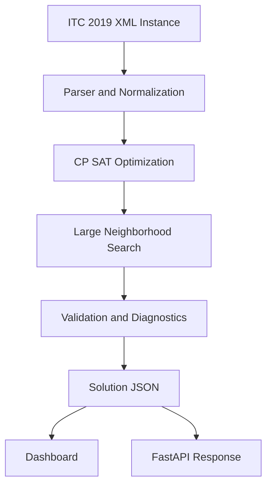
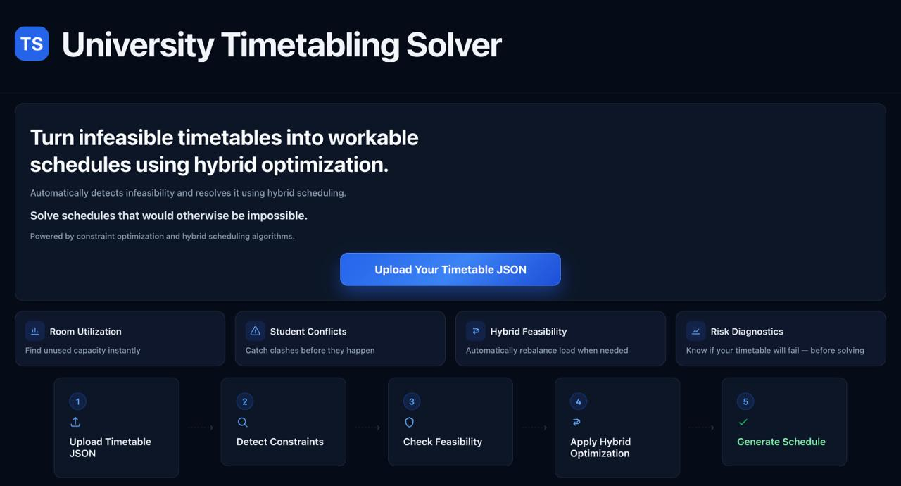
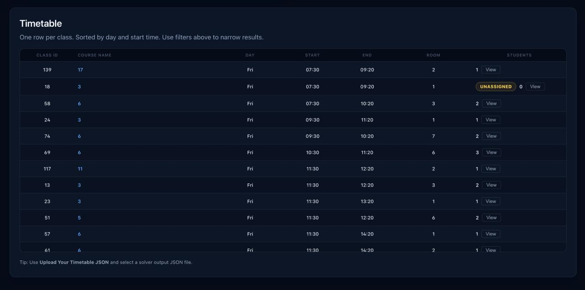
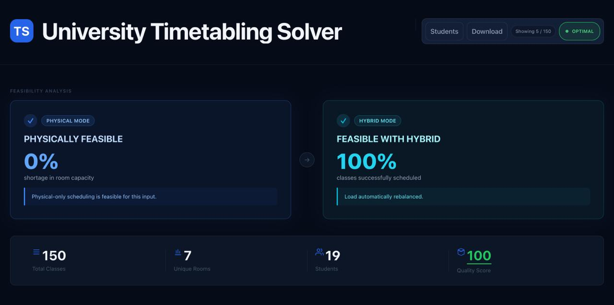
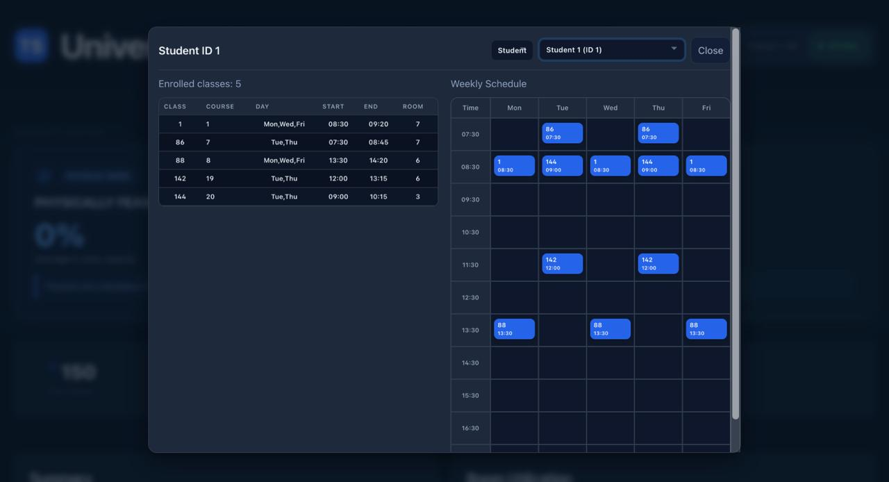

# University Timetabling Solver

[](https://girishk03.github.io/University-Timetabling-Solver/)
[](https://python.org)
[](https://developers.google.com/optimization)
[](LICENSE)

[Live Dashboard](https://girishk03.github.io/University-Timetabling-Solver/) · [Live API](https://university-timetabling-solver.onrender.com/) · [Swagger UI](https://university-timetabling-solver.onrender.com/docs)

> The Render free-tier API may take 30–60 seconds to wake up.

## Project Overview

University Timetabling Solver is a constraint-optimization project for building and repairing university schedules from ITC-2019/UniTime XML instances. It combines Google OR-Tools CP-SAT, a Large Neighborhood Search improvement loop, validation and diagnostics, a JSON solution contract, a FastAPI wrapper, and a browser-based analytics dashboard.

The solver models room, time, capacity, delivery-mode, module-selection, attendance, and student-conflict requirements. It can run in strict mode or, when explicitly enabled, retry an infeasible instance with bounded and penalized relaxations.

## Quick Start

### 1. Clone the repository

```bash
git clone https://github.com/girishk03/University-Timetabling-Solver.git
cd University-Timetabling-Solver
```

### 2. Create and activate a virtual environment

```bash
python3.11 -m venv .venv
source .venv/bin/activate
```

On Windows, use `.venv\Scripts\activate`.

### 3. Install dependencies

```bash
python -m pip install --upgrade pip
pip install -r requirements.txt
```

### 4. Run the solver

```bash
python -m src.run_solver instances/toy_hybrid.json full_solution.json
```

The included toy instance completes quickly and exercises the CP-SAT, LNS, validation, and JSON-output pipeline. Larger ITC-2019 XML instances can require a longer time budget; see [Solver Configuration](#solver-configuration).

### 5. Run the tests

```bash
python -m pip install pytest
python -m pytest
```

### 6. View the dashboard

```bash
python -m http.server 8000
```

Open `http://localhost:8000/index.html`. The dashboard reads `full_solution.json` from the repository root.

## Architecture


```mermaid
graph TD
    A[ITC 2019 XML Instance] --> B[Parser and Normalization]
    B --> C[CP SAT Optimization]
    C --> D[Large Neighborhood Search]
    D --> E[Validation and Diagnostics]
    E --> F[Solution JSON]
    F --> G[Dashboard]
    F --> H[FastAPI Response]
```

The CLI and API share the same solver entry point. The parser normalizes UniTime XML into the internal model, CP-SAT creates a feasible assignment under the configured constraints, LNS searches for improvements around an incumbent solution, and post-solve validation checks the extracted schedule before it is returned or written to disk.

## Hard Constraints vs Soft Constraints

### Hard constraints

Hard constraints define a valid strict-mode timetable. A solution is rejected if it violates them.

- Every class is assigned to exactly one allowed time.
- A physical room hosts at most one class at a time.
- Delivery mode, room assignment, and hybrid capability remain consistent.
- Required modules and selected configurations produce valid class assignments.
- Student attendance is linked to enrollment and delivery decisions.
- Class subscription limits and physical room capacities are respected.
- A student cannot attend more than one class at the same time.

### Soft constraints and objectives

Soft constraints express schedule quality. The solver optimizes applicable objectives lexicographically, fixing each higher-priority result before moving to the next:

1. Maximize students receiving at least one attended class.
2. Minimize bounded relaxation penalties when fallback mode is enabled.
3. Minimize timetable changes during real-time repair.
4. Maximize elective-module satisfaction.
5. Minimize delivery-mode preference deviations.
6. Minimize unnecessary online delivery.
7. Minimize late classes.
8. Minimize consecutive-class penalties.

When `RELAX_ON_INFEASIBLE=1`, selected student-overlap and room-capacity constraints may be relaxed within configured limits and converted into penalties. Other invariants, including room-time exclusivity, remain hard.

## CP-SAT and LNS

### Why CP-SAT

CP-SAT is Google OR-Tools' constraint-programming solver for integer and Boolean models. In this project, decisions such as assigning a class to a time, selecting a room, choosing a delivery mode, and assigning a student are represented as Boolean variables. Constraints encode what must be valid; the ordered objectives encode what makes one valid schedule preferable to another.

For recruiters and reviewers, the important engineering point is that feasibility is not produced by post-processing. The solver enforces the model, and `validate_solution` independently checks the extracted result.

### Why Large Neighborhood Search

Large Neighborhood Search improves an existing schedule without rebuilding every decision from scratch. Each iteration temporarily frees a configured fraction of assignments, keeps the remaining assignments fixed, and asks CP-SAT to re-optimize the open neighborhood. The candidate replaces the incumbent only when its objective tuple improves.

This approach is useful for timetabling because a globally valid schedule can often be improved by reconsidering a focused subset of classes. The same stability concept supports incremental repair, where minimizing timetable churn is more valuable than arbitrarily reshuffling unaffected classes.

## Engineering Decisions

| Challenge | Solution | Engineering Impact |
| --- | --- | --- |
| Multi-domain feasibility | Model time, room, capacity, mode, module, and attendance decisions in CP-SAT | Keeps validity rules explicit and solver-enforced |
| Competing optimization goals | Solve objectives sequentially in lexicographic order | Prevents lower-priority improvements from degrading higher-priority outcomes |
| Improving an incumbent schedule | Apply configurable LNS destroy-and-repair iterations | Searches targeted neighborhoods while retaining a valid baseline |
| Infeasible input instances | Diagnose strict infeasibility and optionally retry with bounded penalties | Makes fallback behavior explicit instead of silently weakening constraints |
| Real-time timetable updates | Build affected sets and penalize assignment changes | Limits disruption to students, rooms, and classes outside the changed area |
| Trustworthy output | Validate extracted schedules and emit diagnostics | Separates solver decisions from independent verification and reporting |
| Browser delivery | Write a stable JSON contract consumed by a static dashboard | Keeps visualization decoupled from the optimization runtime |

## API Endpoints

The Render service runs `uvicorn src.api:app` and exposes the following implemented endpoints:

| Method | Endpoint | Purpose | Input |
| --- | --- | --- | --- |
| `GET` | `/` | Service status and API identification | None |
| `GET` | `/health` | Lightweight health check | None |
| `POST` | `/solve` | Run the solver and return solution JSON | Multipart `.xml` file |
| `GET` | `/docs` | Swagger UI generated by FastAPI | None |

Example request:

```bash
curl -X POST \
  -F "file=@instances/itc2019/wbg-fal10.xml" \
  https://university-timetabling-solver.onrender.com/solve
```

The API accepts ITC-2019 XML uploads, invokes the same CLI solver in a subprocess, returns the generated JSON, rejects non-XML filenames, and enforces a 120-second request timeout.

## Solver Configuration

The main runtime controls are environment variables:

```bash
export BASE_TIME=10.0
export LNS_ITERS=5
export LNS_TIME=1.0
export LNS_DESTROY=0.2
export LNS_SEED=0
export NUM_WORKERS=8
export ENABLE_ONLINE=1
export RELAX_ON_INFEASIBLE=1
export RELAX_MAX_OVERLAP=5
export RELAX_ROOM_OVERCAP=200

python -m src.run_solver instances/itc2019/wbg-fal10.xml full_solution.json
```

These are configuration examples, not benchmark settings. Runtime and solution status depend on the selected instance, hardware, time budget, random seed, and relaxation policy.

## Testing

Install pytest if it is not already available, then run the full suite:

```bash
python -m pip install pytest
python -m pytest
```

Run focused solver tests:

```bash
python -m pytest tests/test_solver_hard_constraints.py
```

Run real-time and stability tests:

```bash
python -m pytest \
  tests/test_realtime_control.py \
  tests/test_realtime_stability_simulation.py \
  tests/test_realtime_run_solver_wrapper.py
```

The tests cover hard-constraint enforcement, day decoding, online-mode behavior, strict-to-relaxed status handling, diagnostics, student-to-class mapping, affected-set construction, real-time control policies, and timetable stability during incremental updates.

Current local result: **39 passed**.

## Dashboard

The static dashboard visualizes the generated JSON without requiring the API. It includes solution status, objective values, room utilization, occupancy diagnostics, class schedules, student schedules, violations, and recommendations.

| Dashboard | Timetable |
| --- | --- |
|  |  |

| Feasibility diagnostics | Student schedule |
| --- | --- |
|  |  |

The feasibility screenshot documents the behavior of the included demonstration data and configuration. It should not be interpreted as a universal guarantee that every infeasible instance can be repaired or that every run reaches a particular feasibility percentage.

## Project Structure

```text
University-Timetabling-Solver/
├── src/
│   ├── api.py                         # FastAPI wrapper
│   ├── run_solver.py                  # CLI and orchestration
│   ├── realtime_control.py            # Incremental scheduling policies
│   └── timetabling/
│       ├── itc2019_parser.py           # UniTime XML parser
│       └── solver_cp_sat.py            # CP-SAT model, validation, and LNS
├── tests/                              # Solver, diagnostics, and real-time tests
├── instances/itc2019/                  # Included benchmark instances
├── docs/                               # Technical notes, audit, UML, and screenshots
├── outputs/replay/                     # Replay artifacts for incremental scenarios
├── tools/replay_runner_real.py         # Replay runner
├── index.html                          # Main static dashboard
├── timetabling-dashboard.html          # Alternate dashboard artifact
├── render.yaml                         # Render service definition
└── requirements.txt                    # Runtime dependencies
```

## Solution Status and Output

The CLI normalizes solver results to four statuses:

- `OPTIMAL` — the solver proved the best result for the configured model and time budget.
- `FEASIBLE` — a valid solution was found without an optimality proof.
- `INFEASIBLE` — no solution exists under the active constraints.
- `UNKNOWN` — no conclusive result was produced within the configured limits.

Solution JSON can include the schedule, student assignments, objective values, violations, constraint metrics, diagnostics, recommendations, and baseline/LNS metadata. Exact values depend on the input and run configuration; this README intentionally does not present them as general benchmarks.

## Future Improvements

- Add a pinned development requirements file so pytest and formatting tools install separately from runtime dependencies.
- Add GitHub Actions for the full pytest suite and API smoke tests.
- Replace the API subprocess boundary with a job queue for long-running solves and concurrent requests.
- Add request-size limits, authentication, persisted jobs, and result retrieval for hosted API use.
- Add schema validation for uploaded XML and generated solution JSON.
- Expand benchmark reporting with reproducible hardware, seed, instance, and time-budget metadata.
- Add cancellation and progress reporting for long optimization jobs.
- Package the dashboard and API as one deployable service with versioned solution artifacts.

## Additional Documentation

- [`docs/technical_notes.md`](docs/technical_notes.md) — decision variables, objective stack, and LNS summary
- [`docs/constraint_enforcement_audit.md`](docs/constraint_enforcement_audit.md) — enforced constraints and layer boundaries
- [`docs/uml/`](docs/uml/) — PlantUML architecture and interaction diagrams

## License

This project is licensed under the [MIT License](LICENSE).
